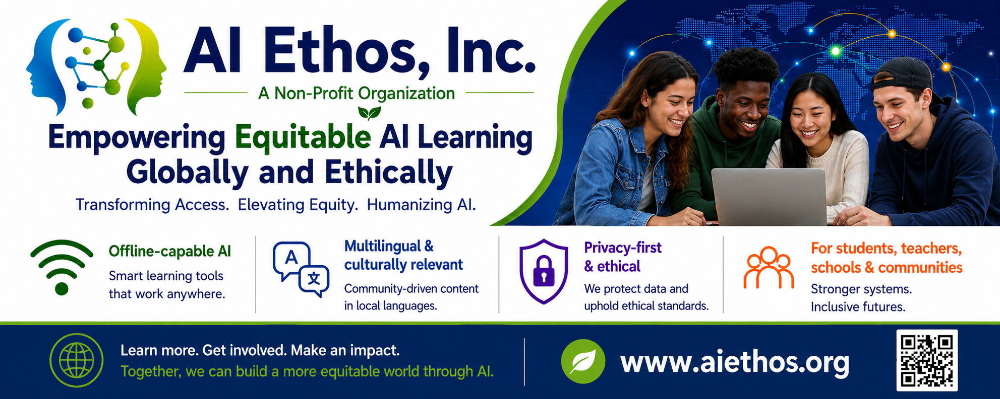
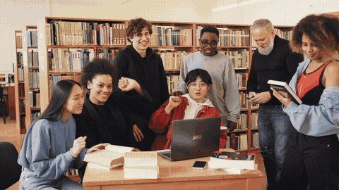

# AI Ethos, Inc. 🤖❤️

**Empowering Equitable AI Learning Globally and Ethically**
A 501(c)(3) nonprofit dedicated to ethical, inclusive, multilingual AI tutoring for underserved learners worldwide.

[(3)%20Nonprofit-f57c00?style=for-the-badge&logo=googlescholar&logoColor=white)](#-nonprofit-at-heart)

**Bridging the AI education divide** — privacy-first, culturally relevant, open-source tutoring that puts equity first. 🌍

---

## 🚀 Our Mission

AI Ethos is a **501(c)(3) nonprofit organization** dedicated to transforming global education through **ethical, inclusive, and culturally relevant AI tutoring**. We operate at the rare intersection of innovation, equity, and access — designing localized, multilingual, and community-inclusive tutoring that prioritizes the most underserved learners: low-income, rural, multilingual, and neurodiverse students.

| 🧭 Pillar | What it means |
|---|---|
| **Equity** | Focused on learners left behind by mainstream AI edtech |
| **Accessibility** | Offline-capable, low-connectivity, multilingual support |
| **Ethics** | Bias-mitigated, transparent, privacy-first by design |
| **Impact** | Measurable outcomes, tracked openly and honestly |

> "AI tutoring for all — not just the privileged few." 🌟

### ⚠️ Why AI Divides — The Problem We Solve

The current state of AI-powered tutoring has created a stark divide: privileged learners reap the benefits while underserved communities are left behind due to limited accessibility, cultural irrelevance, and ethical risk.

- 🚫 Limited access for underserved learners
- 🌐 Lack of cultural relevance and linguistic diversity
- 🔒 Ethical risks: data privacy, bias, lack of transparency

### ✅ What Makes Our Tutoring Different

- **Localized, Learner-Centered Tutoring** — personalized academic support built for low-income and rural learners, even in low-connectivity settings
- **Multilingual & Culturally Responsive Learning** — tutoring in native languages that reflects local contexts
- **Adaptive & Supportive Instruction** — Socratic, step-by-step guidance that adapts to each learner's pace and needs
- **Privacy-First Student Care** — student data is protected by ethical design and never monetized
- **Community-Co-Created Content** — lessons shaped with educators and local communities for relevance and trust

**Guiding principles:** Equity • Accessibility • Fairness • Transparency • Dignity

## 📈 Impact at a Glance

| 📊 1,500+ | 🌐 7 | ✏️ 22% | 🌍 75% | 🧩 20 |
|:---:|:---:|:---:|:---:|:---:|
| Students Reached | Languages Supported | Avg. Math Score Improvement | From Underserved Communities | Neurodiverse Learners Supported |

### 💬 Testimonials

> "I don't have money for private tutors, but AI Ethos feels like having a personal tutor at home. It's changed how I approach school." — **Miguel Torres**, Low-Income Student ⭐⭐⭐⭐⭐

> "AI Ethos finally understands how I learn. I can move slower on some topics and faster on others. I feel in control of my learning." — **Ethan Harlow**, Neurodiverse Learner ⭐⭐⭐⭐⭐

> "AI Ethos has transformed my classroom. Students who previously struggled now engage actively and show real improvement." — **Hannah Whitaker**, Rural School Teacher ⭐⭐⭐⭐⭐

> "Learning in my native language while gradually improving English has made all the difference." — **Lila Nguyen**, Multilingual Learner ⭐⭐⭐⭐⭐

## 🗓️ Our Journey

| Date | Milestone |
|---|---|
| 3/12/2025 | Research on AI tutoring equity gaps begins |
| 3/28/2025 | Mission framework drafted |
| 4/11/2025 | AI Ethos ideation |
| 7/30/2025 | Incorporation approved |
| 9/26/2025 | IRS 501(c)(3) approval |
| 10/5/2025 | Website v1 launched |
| 10/15/2025 | Tutoring launched for 25 students in 1 country |
| 12/1/2025 | Partnership with Legend College Preparatory |
| 2/12/2026 | Neurodiverse-learning module released |
| 4/12/2026 | Impact milestone: 195 learners across 3 countries |
| 6/14/2026 | Program launched for the San Jose Spanish-speaking community |

**Our vision:** reach **100,000 learners across 20 countries by 2030**, expanding multilingual learning, assistive tools, policy influence, and stronger community partnerships.

## 👥 Leadership Team

### Board of Directors

<table>
  <tr>
    <th>Name</th>
    <th>Role</th>
    <th>Key Expertise</th>
  </tr>
  <tr>
    <td><strong>Aaryan Samanta</strong></td>
    <td>President, Founder &amp; CEO</td>
    <td>AI Research • Math Olympiads • Ethical AI • Fluent in Spanish &amp; Bengali</td>
  </tr>
  <tr>
    <td><strong>Jason Li</strong></td>
    <td>Secretary</td>
    <td>International Education • PhD Candidate in Computer Science, University of Pennsylvania</td>
  </tr>
  <tr>
    <td><strong>Guillermo Nicolás Villalba Cuesta</strong></td>
    <td>Director</td>
    <td>Finance &amp; Economics Strategy • Madrid, Spain • Fluent in Spanish &amp; English</td>
  </tr>
  <tr>
    <td><strong>Laurence Dang</strong></td>
    <td>Director</td>
    <td>Academic Dean, Math &amp; Sciences, Legend College Preparatory • Fluent in English, French &amp; German</td>
  </tr>
</table>

### Board of Advisors

<table>
  <tr>
    <th>Name</th>
    <th>Key Expertise</th>
  </tr>
  <tr>
    <td><strong>Dr. Yan Liu</strong></td>
    <td>AI &amp; Data Science • Former Stanford Post-Doc • Co-founder, 7EDU • Data Scientist, Coursera</td>
  </tr>
  <tr>
    <td><strong>Dr. Alexander Mario Blum</strong></td>
    <td>Special Education • Literacy &amp; Cognition • Post-Doctoral Scholar, Stanford University</td>
  </tr>
</table>

## 🤝 Partners

- **Academic** — [Legend College Preparatory](https://legendcp.com/), a WASC-accredited AI-forward school in Cupertino, CA
- **More collaborations coming** — NGOs, educators, and ethical tech organizations

## 🛠️ Our Work

- **Events & Programs** — adaptive tutoring pilots, multilingual curriculum co-creation, educator training
- **How We Scale** — Mission Anchoring → Build & Tools → Co-Creation & Partnerships → Impact Measurement → Scale & Sustainability
- **Scaling Vision** — open-source tools → local partnerships → global reach

## 🙌 Get Involved — Support the Mission!

Join us in making ethical AI education accessible to all.

| | Action | Why it matters |
|---|---|---|
| 💜 | **[Donate](mailto:donate@aiethos.org)** | $500 funds 3 months of tutoring for 10 students · $1,000 funds a field pilot · $5,000+ enables a full program launch |
| 💚 | **[Volunteer](mailto:volunteer@aiethos.org)** | Co-create curriculum, support field pilots, train partners — earn certificates, leadership roles (EVP/VP/Deputy), and global portfolio experience |
| 💛 | **[Partner](mailto:partner@aiethos.org)** | NGOs, schools, governments, and ethical AI organizations — co-design curriculum, launch pilots, build local capacity |

## 📬 Contact Us

**AI Ethos, Inc.** | 501(c)(3) Nonprofit | Cupertino, CA, USA | Global Reach, Equity-Driven

- 📧 General: [contact@aiethos.org](mailto:contact@aiethos.org)
- 🌐 Website: [www.aiethos.org](https://www.aiethos.org)
- 💜 Donate: [donate@aiethos.org](mailto:donate@aiethos.org)
- 💚 Volunteer: [volunteer@aiethos.org](mailto:volunteer@aiethos.org)
- 💛 Partnerships: [partner@aiethos.org](mailto:partner@aiethos.org)
- 🕘 Office Hours: Mon – Fri, 9AM – 5PM (PT)

**Together, let's build education that leaves no one behind.** 🌍🤝🚀

© AI Ethos, Inc. — a registered 501(c)(3) nonprofit organization.

